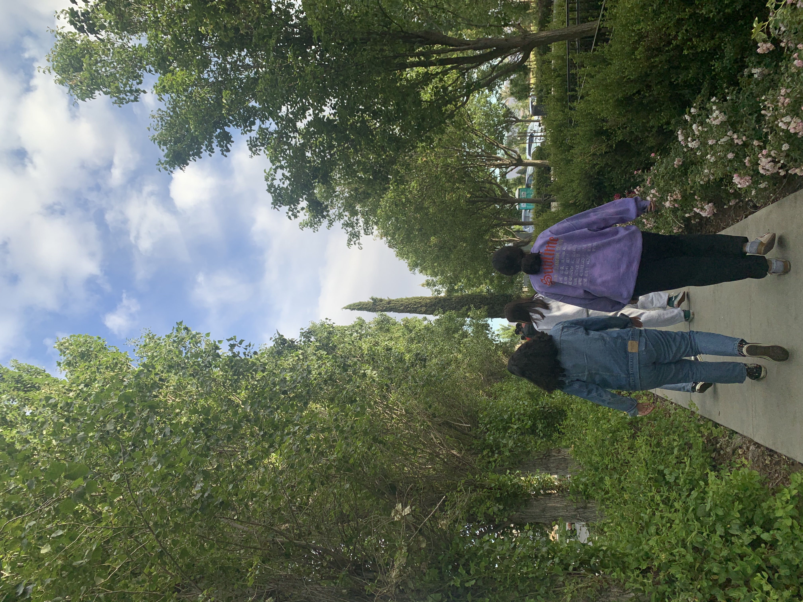
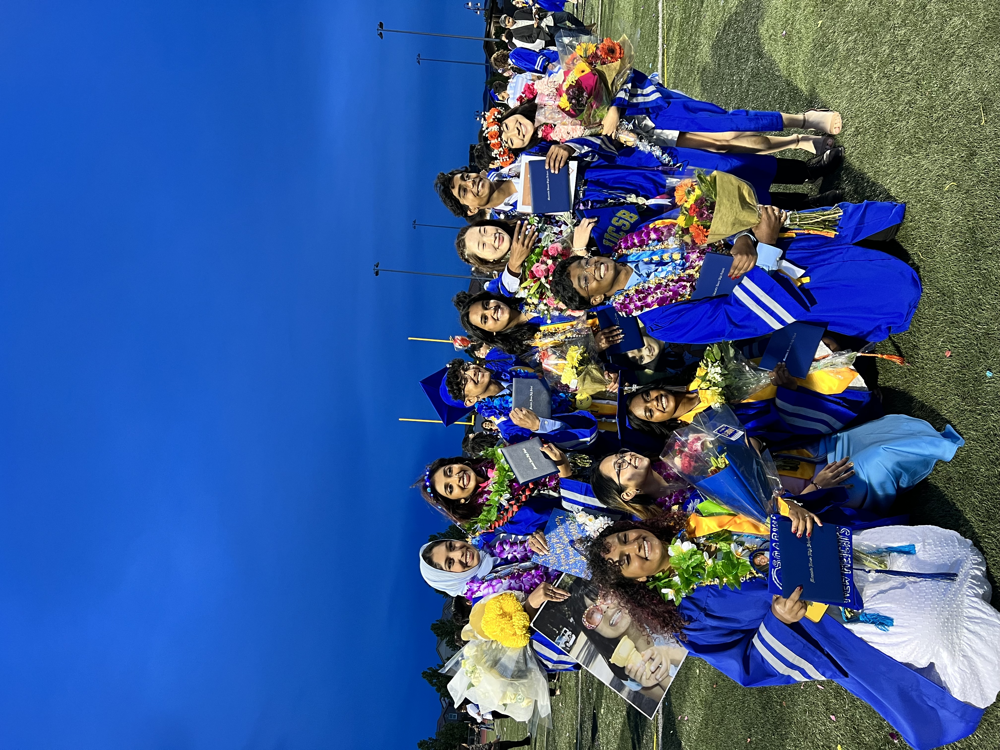
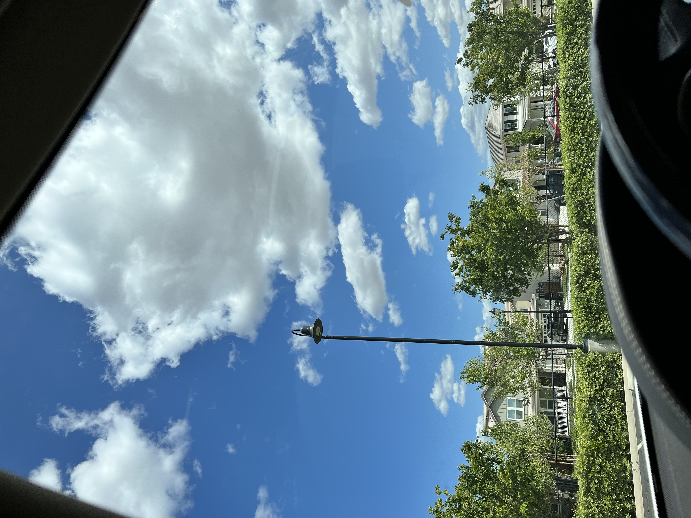
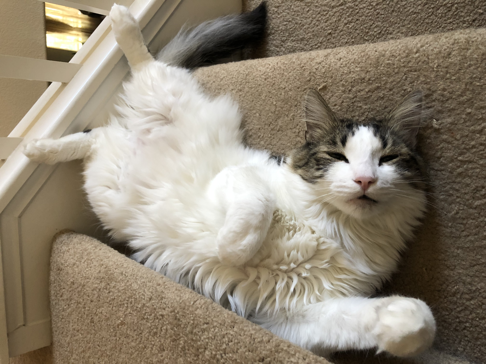
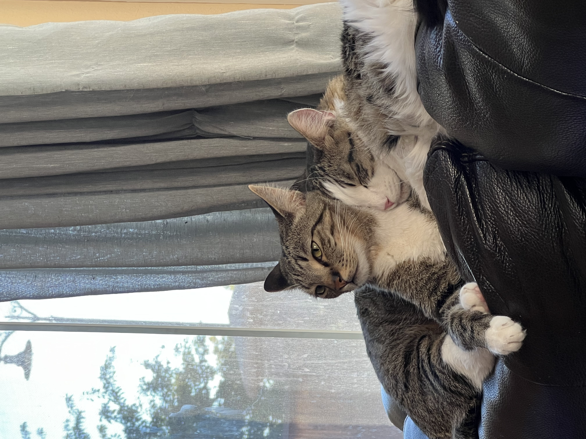
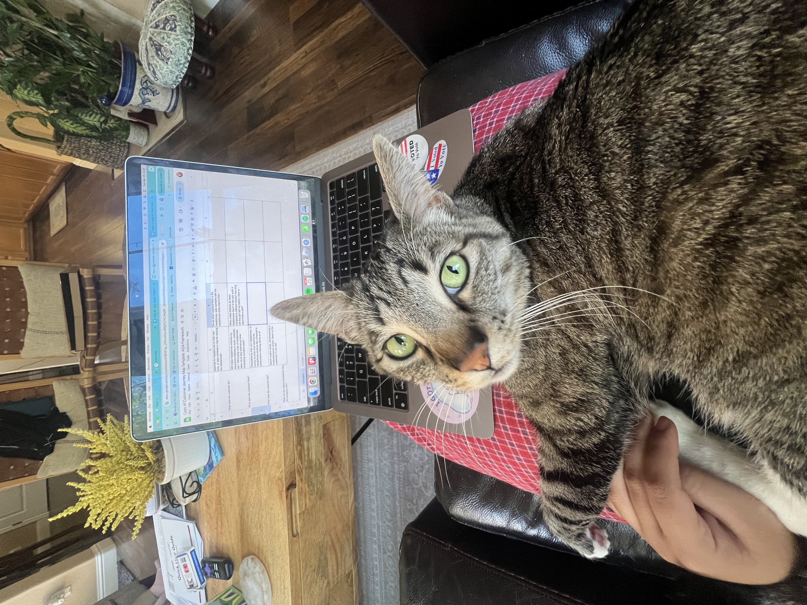
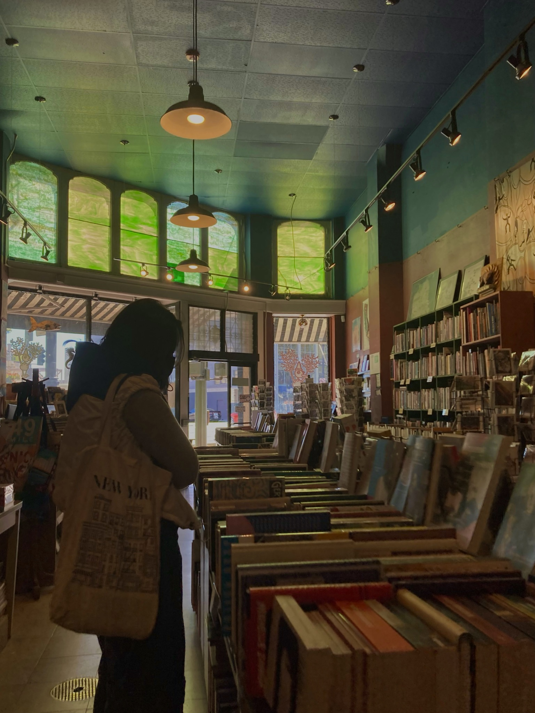
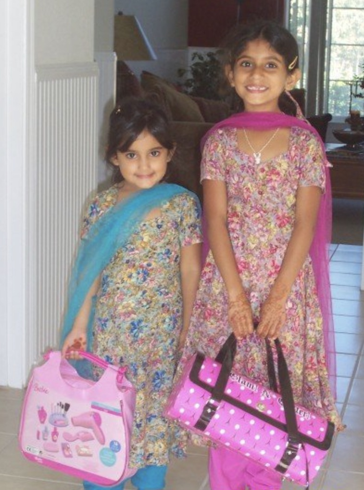
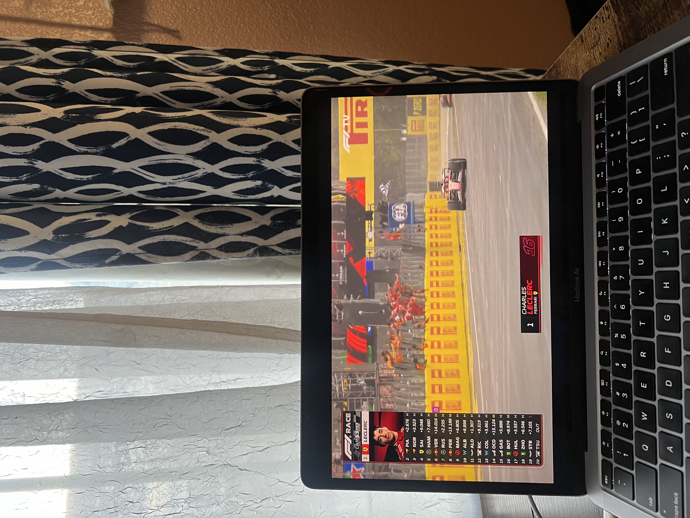

###  Where I'm from

I’m originally from Mountain House, California, where my family has lived for the past 21 years. I grew up watching the town change from just a few hundred houses into a fully established community. Because it was such a small place for most of my childhood, everyone knew everyone. I grew up alongside many of the same people for years and eventually graduated high school with classmates I had first met in kindergarten.

Living in a town where there wasn’t always much to do taught me to be resourceful and to appreciate the slower pace of everyday life. Mountain House is where I learned to enjoy simple things, like taking long walks and spending time outside. Growing up there gave me a strong sense of community and helped shape the way I value connection, quiet moments, and the scenery around me.

::: {layout="[[1, 1, 1]]"}
{group="Home"}

{group="Home"}

{group="Home"}
:::

###  Pets

I’ve always loved cats because their affection feels earned. They’re independent, never afraid to set their boundaries, and when they do choose to show love, it feels especially meaningful. In January 2021 my family adopted two cats, Caesar and Felix, who are brothers with very different personalities. They don’t usually spend much time together because each prefers doing things their own way, but every once in a while I’ll catch them curled up together for a nap.

Felix is the troublemaker of the two. If you hear someone bouncing off the walls at three in the morning, it’s almost certainly him. He’s restless and curious, but he’s also very affectionate and always ready to demand pets from the people he loves. Caesar, on the other hand, is much more of a lone wolf. He’s selective about who he gives his attention to and spends most of his day asleep on someone’s bed. The remaining few hours are usually dedicated to convincing us that he absolutely needs another snack.

::: {layout="[[1, 1, 1]]"}
{group="Cats"}

{group="Cats"}

{group="Cats"}
:::

###  Hobbies and Interests

In my free time, I enjoy reading, especially when I can do it outdoors. One of my favorite things to do during my time at UCSB has been finding a quiet spot on a sunny day and spending a couple of hours getting lost in a book. I only really got into reading during quarantine, but it quickly became one of my favorite ways to unwind. My favorite book I’ve read since then is _The Song of Achilles_ by Madeline Miller, and an honorable mention goes to the Harry Potter series, which is a story I’ll never get tired of revisiting.

Recently, I’ve also started learning how to knit. My grandma used to knit sweaters and sew outfits for me and my sister when we were younger, and it’s something I’ve always wanted to be able to do myself. There’s something really satisfying about watching a simple roll of yarn turn into something tangible that you can actually wear and say you made on your own.

I’m also a big Formula 1 fan. No matter how early the race starts, I’ll usually set an alarm to watch it live. Race weekends have become something I genuinely look forward to, and I rarely miss one. Oscar Piastri WDC soon!

::: {layout="[[1, 1, 1]]"}
{group="Hobbies"}

{group="Hobbies"}

{group="Hobbies"}
:::
